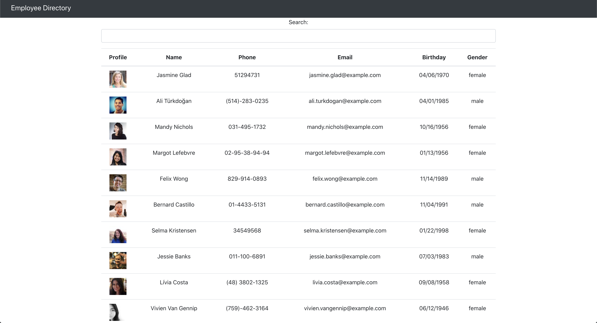

# Employee Directory

## Description
Loads an employee directory into a table and allows you to sort and search by the different columns

<a href="https://willh33.github.io/employee_directory_will_h/">Deployed Application</a>

## Table of Contents
* [Installation](#installation)
* [Usage](#usage)
* [License](#license)
* [Contributing](#contributing)
* [Tests](#tests)
* [Questions](#questions)

## Installation
To install the necessary dependencies, run the following command

`yarn install`

## Usage

Just pull down, run it and your good to go

## License
This project is licensed under MIT

## Contributing
Go ahead and pull the repo down, make the changes and submit a pull request

## Tests
To run tests, run the following command

`npm run tests`

## Questions
If you have questions about the repo, open an issue or contact me directly at wharrison33@hotmail.com. You can find more of my work at willh33
  